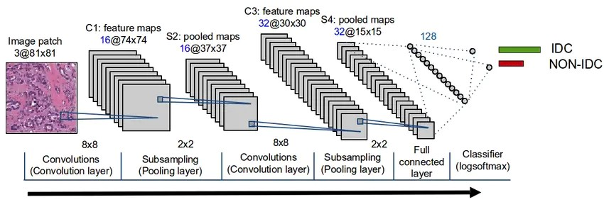

---

# Malaria Classification using TensorFlow 2 and Keras


This project demonstrates how to build a deep learning model to classify cell images as infected or not infected with Malaria. It utilizes TensorFlow 2 and the Keras API in Python. The model is trained on the Malaria Cell Images Dataset and achieves high accuracy in distinguishing between infected and uninfected cells.

## Table of Contents
- [Introduction](#introduction)
- [Getting Started](#getting-started)
  - [Prerequisites](#prerequisites)
  - [Installation](#installation)
  - [Dataset](#dataset)
- [Data Preprocessing](#data-preprocessing)
- [Model Architecture](#model-architecture)
- [Training](#training)
- [Model Evaluation](#model-evaluation)
- [Inference](#inference)
- [Saving the Model](#saving-the-model)

## Introduction

Deep learning has made significant advancements in the medical field, from patient diagnosis to computer vision applications. In this project, we implement a deep learning model for the binary classification of cell images as either infected or uninfected with Malaria. The model is trained using TensorFlow 2 and the Keras API in Python.

## Getting Started

### Prerequisites

Before you begin, ensure you have the following libraries installed:

- NumPy
- TensorFlow
- OpenCV-Python
- scikit-learn
- Matplotlib

You can install these libraries using the following command:

```bash
pip install numpy tensorflow opencv-python scikit-learn matplotlib
```

### Installation

1. Clone this repository:

```bash
git clone https://github.com/yourusername/malaria-classification.git
cd malaria-classification
```

2. Download the Malaria Cell Images Dataset from Kaggle and extract it https://www.kaggle.com/iarunava/cell-images-for-detecting-malaria

3. Place the `cell_images` folder in the project's working directory.

4. Create a `testing-samples` folder and move a few test images to it for later inference.

### Dataset

The dataset used in this project contains cell images categorized into two classes: Parasitized and Uninfected. These images are used for training and testing the model.

## Data Preprocessing

Images are preprocessed using OpenCV. They are converted to grayscale and resized to a (70x70) shape. The dataset is loaded, and images are normalized to help the neural network learn faster. Data is split into training and testing sets, and shuffling is performed.

## Model Architecture

The model architecture consists of convolution layers, activation functions, max-pooling layers, and fully connected layers. The output layer uses a sigmoid activation function for binary classification. Here's an overview of the model:

- Convolution Layer 1: 64 filters, (3x3) kernel size
- Activation: ReLU
- Max-Pooling Layer 1: (2x2) pool size
- Convolution Layer 2: 64 filters, (3x3) kernel size
- Activation: ReLU
- Max-Pooling Layer 2: (2x2) pool size
- Convolution Layer 3: 64 filters, (3x3) kernel size
- Activation: ReLU
- Max-Pooling Layer 3: (2x2) pool size
- Flatten Layer
- Dense Layer 1: 64 units, Activation: ReLU
- Dense Layer 2: 64 units, Activation: ReLU
- Output Layer: 1 unit, Activation: Sigmoid

## Training

The model is trained for 3 epochs with a batch size of 64. You can adjust these hyperparameters according to your requirements. The training process will output accuracy and loss values.

## Model Evaluation

The model is evaluated on the testing dataset, and accuracy and loss metrics are displayed.

## Inference

You can use the trained model to make inferences on new images. Provided test images are used to demonstrate the model's ability to classify infected and uninfected cells.

## Saving the Model

The trained model can be saved for later use. You can load the model using the saved weights for quick inference without retraining.

---
